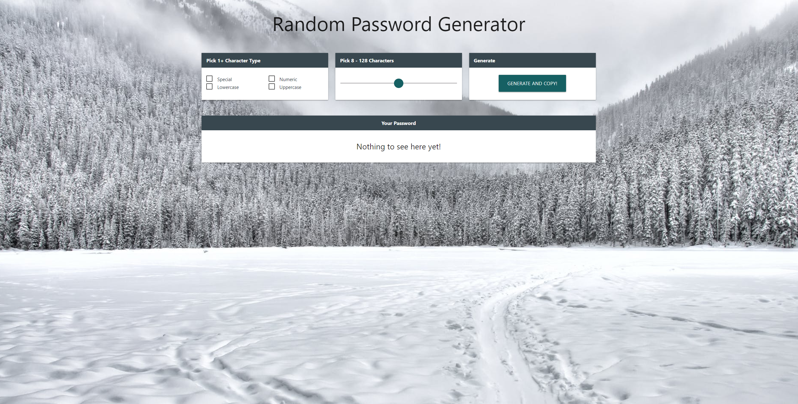

# JavaScriptPasswordGenerator
*My Random Password Generator made with JavaScript and Materialize CSS*

UPDATES:

1. Needs on Dark Mode
2. JavaScript conditionals can be re-factored into a functional component
3. Working on a Medium article

[View Deployed Application Here.](https://pythonidaer.github.io/JavaScriptPasswordGenerator/)

## Installation
1. Clone repository to your local device
2. Test by opening the index.html file in your browser. If it looks good, it's working right.
3. If it does not work, right-click Inspect console to determine if there is an issue with the directories.

## Usage
This repo is simply a homework assignment. Feel free to inspect the code and notice how I made an accessible and responsive, validated JavaScript Password Randomizer:
- Checkboxes
- Range Slider
- Materialize Modal Alerts
- Copy Feature
- Dark Mode
  
## Credits
[Web Dev](https://web.dev/label/?utm_source=lighthouse&utm_medium=devtools) This link from Lighthouse talk me how to make a `input type=range` accessible with `label for`.

[The Net Ninja](https://www.youtube.com/watch?v=j6y1UVxr3jg&list=PL4cUxeGkcC9gGrbtvASEZSlFEYBnPkmff&index=7) Taught me how to utilize Materialize CSS, Containers, Modals, etc.

[Range Slider Issue](https://github.com/Dogfalo/materialize/issues/6036) Explained why some of the Materialize CSS features were not working for me.

[Styling the Range Slider](https://stackoverflow.com/questions/40534973/changing-the-color-of-the-range-slider-in-materializecss) Taught me how to change the color of the range slider in Materialize CSS.

[Pexels](https://www.pexels.com/photo/a-clear-sky-at-night-2885320/) I love getting free photos from this website!

[CSS Tricks](https://css-tricks.com/almanac/properties/o/overflow-wrap/) This article taught me how to wrap a long word, so the password did not overflow outside the box.

[jQuery A-Z](https://www.jquery-az.com/materialize/demo.php?ex=57.0_3) Here I learned how to add box-shadow to checkboxes.

[Button Color](https://materializecss.com/color.html) Materialize CSS provides a very beautiful and generous palette of color options.

[DesignCourse](https://www.youtube.com/watch?v=ZKXv_ZHQ654) Gary Simon is awesome! He taught me how to set up a Dark Mode toggle on this project.

[Background Image Sizing](https://css-tricks.com/forums/topic/background-image-height-problem-not-fitting-to-the-screen/) Another great CSS Tricks article that helped me make sure the background-image covered the entire background.

[CSS Portal](https://www.cssportal.com/style-input-range/) This website helped me change the size of the range slider in Materialize CSS.

[MDN Docs](https://developer.mozilla.org/en-US/docs/Web/API/HTMLElement/change_event) Here I learned how to utilize the change event for sensing when a checkbox has been checked or unchecked.

[CSS Tricks: Fallback Colors](https://css-tricks.com/css-basics-using-fallback-colors/) I learned how to fall back on background colors if/when my background images for some reason do not load.

[MDN Docs: querySelectorAll](https://developer.mozilla.org/en-US/docs/Web/API/Document/querySelectorAll) Showed me how to further narrow my query so that I did not include toggle when I searched for checked boxes.

[Marcus Burnette // Codepen](https://codepen.io/mburnette/pen/LxNxNg) I followed along Gary Simon's tutorial, where he styles dark mode based off this pen of a toggler made by Marcus.

[Tiny PNG](https://tinypng.com/) This website allowed me to compress my background images and shave off over 2000 kilobytes!

[Optimizilla](https://imagecompressor.com/)Here I was able to further reduce background image size from megabytes to <250kb each.

[Check if an Element contains a Class](https://www.javascripttutorial.net/dom/css/check-if-an-element-contains-a-class/) Uses .contains() method.

[Jennifer Kirwin](https://jenniferkirwin.github.io/password-generator2/) Jennifer's brilliant styles influenced me on utilizing Materialize CSS. Hopefully someday I'll understand what she did with arrays as well! Definitely worth reading her code.

[Jamie Rachael](https://jamierachael.github.io/Password-Generator/) Jamie's custom design first encouraged me to improve the original template provided to us. I also really liked her 'Copy to Clipboard' feature, but in the interest of trying something new, I combined 'Generate' and 'Copy' into one button on my project.
  
## License
I've chosen an MIT License. Do what you'd like with this material.

#### The Proof

#### The Website
